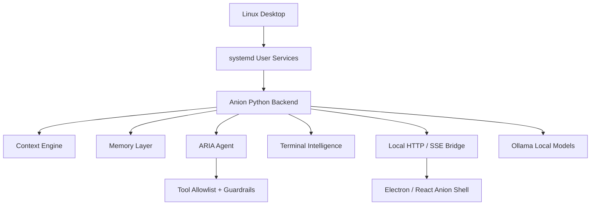

# Anion

### A local AI operating layer for the Linux desktop.

> This is a public product/architecture documentation repository. The Anion source code is private during beta and security hardening.

---

<!-- Screenshot will be added once the beta UI is finalized -->
<!--  -->

---

## Overview

Anion is a privacy-first, locally operated AI assistant layer built specifically for the Linux desktop. It bridges the gap between disjointed command-line tools, local filesystems, cross-device workflows, and AI assistants — creating a cohesive, context-aware environment where the AI lives alongside the user on the OS.

Unlike cloud-dependent wrappers, Anion runs entirely on your machine. It uses local LLMs through [Ollama](https://ollama.ai), manages background services through systemd, and streams real-time state updates to a modern Electron/React desktop shell.

---

## What I Built

A complete AI desktop operating layer from scratch, including:

- **A Python backend daemon architecture** managed by systemd user services, providing context engines, memory stores, and an agentic assistant loop.
- **An Electron/React desktop shell** (`anion-shell`) with a Three.js-powered "Brain" visualization, ambient presence bar, and dynamic widget dashboard.
- **ARIA** — a bounded agentic voice and text assistant with a strict tool allowlist, privacy gates, and approval-required actions.
- **Terminal Intelligence** — a smart CLI wrapper with auto-recovery suggestions, risk previews for destructive commands, and persistent command history.
- **Cross-Device Sync** — end-to-end encrypted peer-to-peer state transfer using NaCl Curve25519 cryptography over LAN.
- **A comprehensive test harness** with 742+ tests, chaos testing, 24-hour soak tests, SAST/SCA security scanning, and DAST probes.

---

## System Architecture

Anion operates on a client-server architecture running entirely on `localhost`. The Python backend exposes a unified HTTP/SSE API on `127.0.0.1:9120` that powers the Electron UI. The frontend is strictly a display layer — all business logic, state management, and AI reasoning happen in the backend.

**Key architectural decisions:**

| Layer | Technology | Role |
|:---|:---|:---|
| Daemon orchestration | systemd user targets | Reliable service lifecycle |
| Core backend | Python 3.11+ | Context, memory, ARIA, terminal tools |
| Communication | HTTP REST + SSE | Real-time state streaming |
| Desktop shell | Electron + React + Vite | Rich UI with Three.js visualizations |
| AI inference | Ollama (local) | Privacy-preserving LLM execution |
| Data storage | SQLite (WAL mode) | Persistent memory and history |
| Encryption | NaCl / Curve25519 | Cross-device E2E encryption |

---

## Key Features

### 🤖 ARIA — Agentic Assistant
A ReAct-based assistant with 22 strictly defined tools, privacy redaction, risk tiers, and hard budget limits on LLM steps and tool calls. ARIA cannot run arbitrary shell commands — it halts and asks for explicit approval on sensitive actions.

### 🖥️ Terminal Intelligence
An intelligent CLI wrapper with SQLite-backed persistent history, deterministic risk previews (catches `rm -rf` before execution), and hybrid rule-based/LLM recovery suggestions for common errors like `ModuleNotFoundError`.

### 🧠 Context & Memory Engine
Continuously indexes active windows, terminal operations, and filesystem events into a local SQLite database (WAL mode). Powers ARIA's understanding of "summarize this window" or "what was I working on?"

### 🔄 Cross-Device Sync
Custom UDP LAN discovery with 6-digit PIN pairing and NaCl Curve25519 E2E encrypted channels. Syncs timeline events and state diffs across multiple Linux machines.

### 🧬 Live Neural Brain
A Three.js-powered holographic visualization in the desktop shell that pulses in response to real-time system load and backend health.

### 🎯 Feature Activation Engine
Context-aware UI nudges that trigger based on user state (`debug_flow`, `resume`, `stuck`). A policy refinement engine dynamically adjusts thresholds based on user acceptance.

### 🔒 Privacy & Guardrails
Local-first by design. A `PrivacyRedactor` checks prompts before any cloud routing. ARIA tools pass through `anion_guardrail` with a hardcoded `TOOL_ALLOWLIST` and `RISK_TIERS`. Plugin execution is constrained by RLIMIT (memory/CPU/FD).

---

## Why This Was Technically Interesting

1. **Deep OS integration on Linux** — Anion hooks directly into systemd, FUSE, Sway/i3 IPC, and X11 (`wmctrl`/`xdotool`) for genuine desktop awareness. This isn't possible in generic cross-platform apps.

2. **Bounded agentic AI** — ARIA is a real agentic system (ReAct loop, tool chaining), but with strict guardrails. Designing the balance between autonomy and safety — tool allowlists, risk tiers, budget limits, approval gates — was a core challenge.

3. **Real-time state streaming** — The backend pushes all state via SSE on a single channel. The UI has zero business logic — it's a pure renderer. This separation keeps the system debuggable and testable.

4. **Custom encrypted sync protocol** — Instead of relying on cloud services, cross-device sync uses raw UDP discovery and NaCl cryptography, giving users full control over their data.

5. **Production-grade testing** — 742+ tests across unit, integration, e2e, chaos, and 24-hour soak scopes. Security scanning (Bandit SAST, pip-audit SCA, DAST) integrated into the release gate.

---

## Screenshots

> Screenshots are being prepared for the public repository. See [`assets/screenshots/README.md`](./assets/screenshots/README.md) for the planned screenshot set.

| Screenshot | Description |
|:---|:---|
| `dashboard.png` | Main Anion desktop shell with Brain visualization |
| `aria-assistant.png` | ARIA assistant interaction panel |
| `terminal-intelligence.png` | Terminal risk preview and auto-recovery |
| `context-memory.png` | Context and memory dashboard |
| `cross-device-sync.png` | Cross-device pairing and sync flow |

---

## Tech Stack

| Component | Technology |
|:---|:---|
| **Backend** | Python 3.11+, SQLite (WAL), FUSE |
| **Frontend** | Electron 33, React 19, Vite 8, Three.js, Framer Motion |
| **AI Runtime** | Ollama (local LLM inference) |
| **Service Management** | systemd user targets and services |
| **Desktop Integration** | wmctrl, xdotool, swaymsg, i3-msg |
| **Encryption** | NaCl / Curve25519 (PyNaCl) |
| **Testing** | pytest (742+ tests), Bandit, pip-audit, custom DAST |
| **Packaging** | Electron-Builder (AppImage + .deb) |

---

## Testing and Quality

Anion uses a comprehensive `anion test` harness:

| Scope | Purpose | Status |
|:---|:---|:---|
| `quick` | Smoke checks (< 2 min) | ✅ Available |
| `full` | Full regression suite | ✅ Available |
| `e2e` | End-to-end validation | ✅ Available |
| `chaos` | Failure-state testing | ✅ Available |
| `soak` | 24-hour stability testing | ✅ Available |
| `gate` | Release readiness check | ✅ Available |

**Security scanning:**
- **SAST (Bandit):** 9 HIGH findings under audit (subprocess calls with controlled inputs)
- **SCA (pip-audit):** 65 CVEs in dev dependencies (not shipped in production artifacts)
- **Secret scan:** 0 findings across 24,700 files
- **DAST:** 15-probe sweep clean (no 5xx, no crashes, no timeouts)

---

## Product Status

Anion v1 is a **Linux-only release candidate**. It is feature-complete for its intended scope but is undergoing:

- Dependency CVE remediation
- Subprocess security audit
- Packaging validation
- Public documentation finalization

This is beta software. Expect rough edges.

---

## Why the Source Is Private

Anion's source code remains private during this phase because:

1. **Security hardening is in progress** — Known subprocess findings and dependency CVEs need resolution before public exposure.
2. **Beta stability** — The system is feature-complete but not yet consumer-ready.
3. **Responsible disclosure** — Opening the source prematurely could expose attack surface before mitigations are in place.

The plan is to open-source Anion after the security cleanup is complete.

---

## Documentation

| Document | Description |
|:---|:---|
| [Architecture](docs/ARCHITECTURE.md) | High-level system architecture and service topology |
| [System Design](docs/SYSTEM_DESIGN.md) | Design decisions, tradeoffs, and rationale |
| [Feature Breakdown](docs/FEATURE_BREAKDOWN.md) | Complete feature inventory with status |
| [ARIA Agent](docs/ARIA_AGENT.md) | Agentic assistant deep dive |
| [Terminal Intelligence](docs/TERMINAL_INTELLIGENCE.md) | Smart CLI features and safety |
| [Context & Memory](docs/CONTEXT_AND_MEMORY.md) | Context engine and memory layer |
| [Cross-Device Sync](docs/CROSS_DEVICE_SYNC.md) | Encrypted peer-to-peer sync |
| [Testing & QA](docs/TESTING_AND_QA.md) | Test philosophy and security scanning |
| [Product Decisions](docs/PRODUCT_DECISIONS.md) | Why Linux-only, why local-first, pivot history |
| [User Manual](docs/USER_MANUAL.md) | End-user guide |
| [Install Guide](docs/INSTALL_LINUX.md) | Linux installation instructions |
| [FAQ](docs/FAQ.md) | Frequently asked questions |
| [Roadmap](docs/ROADMAP.md) | Future development priorities |
| [Release Notes](docs/RELEASE_NOTES.md) | v1 RC release summary |

---

## Early Beta

Anion is in **private beta**. To request access:

1. Fill out the [Beta Access Form](https://forms.gle/PLACEHOLDER) <!-- TODO: Replace with actual form link -->
2. You will receive an installation link and repository access upon approval

Beta access can be revoked at any time. Please report issues through the GitHub issue templates.

---

## My Role

I am the sole developer and architect of Anion. I designed and implemented:

- The full Python backend architecture (daemon services, HTTP bridge, memory engine, context system)
- The ARIA agentic assistant (ReAct loop, tool schemas, guardrails, privacy redaction)
- The Electron/React desktop shell (UI components, Three.js Brain, SSE integration)
- The terminal intelligence system (history, recovery, risk preview)
- The cross-device encrypted sync protocol
- The comprehensive test harness (742+ tests, chaos, soak, security scanning)
- The systemd service architecture and packaging pipeline

---

## Contact

- **GitHub:** [GopalSinghRajput](https://github.com/GopalSinghRajput)
- **Beta Access:** [Application Form](https://forms.gle/PLACEHOLDER) <!-- TODO: Replace with actual form link -->

---

  Built with care by Gopal Singh Rajput

