<div align="center">


<br />

# 🧠 Anion

### A local AI operating layer for the Linux desktop.

<br />

[](docs/INSTALL_LINUX.md)
[](#-early-beta)
[](PRIVACY.md)
[](#-why-this-was-technically-interesting)
[](docs/TESTING_AND_QA.md)

<br />

**Linux-native · Local-first · ARIA-powered · Terminal-aware · Privacy-conscious**

<br />

<a href="docs/ARCHITECTURE.md"><strong>Architecture</strong></a>
· <a href="docs/FEATURE_BREAKDOWN.md">Features</a>
· <a href="docs/ARIA_AGENT.md">ARIA</a>
· <a href="docs/TESTING_AND_QA.md">Testing</a>
· <a href="docs/ROADMAP.md">Roadmap</a>
· <a href="#-early-beta">Beta Access</a>

<br />
<br />

> **Public documentation repository**
> This repository documents Anion’s architecture, product design, features, screenshots, diagrams, release notes, and beta access.
> The production source code is private during beta and security hardening.

</div>

---

## 🎯 Recruiter Snapshot

| Signal                 | What it shows                                                                                                                                                                           |
| ---------------------- | --------------------------------------------------------------------------------------------------------------------------------------------------------------------------------------- |
| **End-to-end system**  | Built a Linux-native AI desktop layer combining Python backend services, Electron/React UI, Ollama local models, ARIA agent runtime, terminal intelligence, and context/memory systems. |
| **AI infrastructure**  | Designed local model runtime integration, local services, context pipelines, and backend-driven UI state.                                                                               |
| **Agentic safety**     | Built a bounded assistant with tool allowlists, risk tiers, privacy checks, and approval-required actions.                                                                              |
| **Release discipline** | Implemented release-focused testing across quick, full, e2e, chaos, soak, security, and gate validation flows.                                                                          |
| **Relevant roles**     | AI infrastructure, ML systems design, local AI runtimes, agentic systems, developer tooling, Linux services.                                                                            |

---

## ⚡ Overview

**Anion** is a privacy-first AI assistant layer built for the Linux desktop.

It connects local model inference, terminal intelligence, desktop context, workspace awareness, memory, and a real-time desktop shell into one local-first AI system.

Most AI assistants live in a browser tab. Anion is designed to live beside the operating system.

It can understand the current desktop workflow, reason over local context, assist through ARIA, and surface useful automation while keeping sensitive actions bounded by guardrails and approval flows.

---

## 🖼️ Product Preview

<p align="center">
  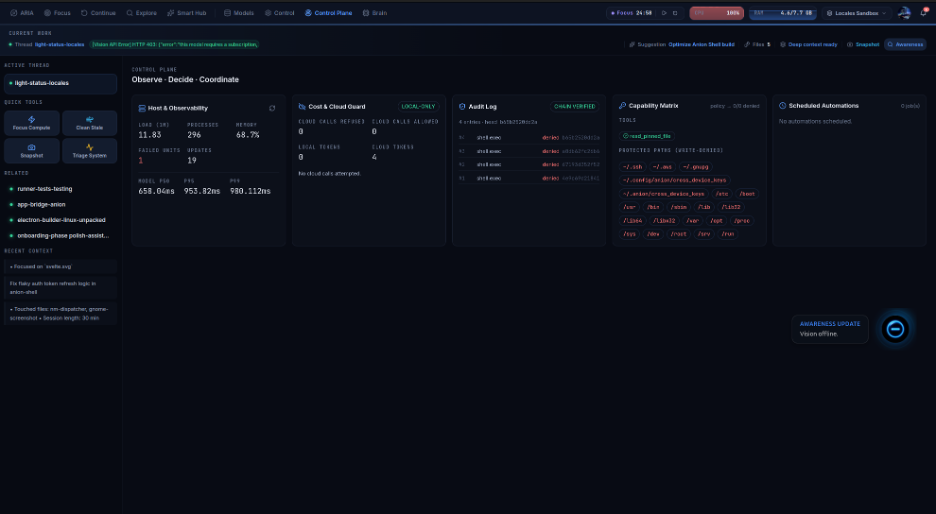
</p>

<p align="center">
  <em>Anion control plane showing local AI state, system context, and runtime status.</em>
</p>

---

## 🧩 What I Built

<table>
<tr>
<td width="50%" valign="top">

### 🧠 AI Runtime Layer

* Local model integration through Ollama
* ARIA bounded agent loop
* Tool allowlists and risk tiers
* Approval-required action flow
* Privacy redaction before sensitive routing

</td>
<td width="50%" valign="top">

### 🖥️ Linux Desktop Layer

* systemd user services
* FUSE semantic filesystem layer
* X11 / Sway / i3 workspace awareness
* Local HTTP/SSE state bridge
* Electron/React desktop shell

</td>
</tr>
<tr>
<td width="50%" valign="top">

### 🧪 Reliability Layer

* 742+ tests
* quick / full / e2e / chaos / soak / gate scopes
* Bandit, pip-audit, DAST, and secret scanning
* Release-candidate validation workflow

</td>
<td width="50%" valign="top">

### 🔐 Privacy + Safety Layer

* Local-first design
* Local memory and context storage
* Guardrailed ARIA tools
* Explicit approvals
* Encrypted cross-device sync path

</td>
</tr>
</table>

---

## 🏗️ Architecture Overview

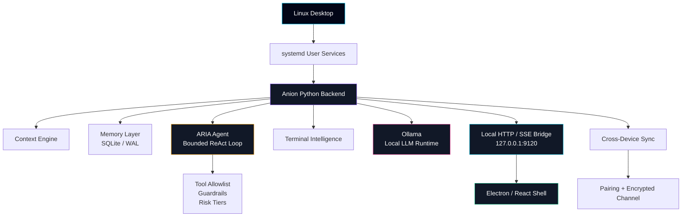

### Design principle

> The backend is active.
> The frontend is a live renderer.

The Electron shell does not own the core intelligence. It reflects backend state streamed through the local HTTP/SSE bridge. This keeps orchestration, memory, tool execution, and guardrails in the Python backend instead of scattering logic across the UI.

---

## 🗺️ Architecture Map

This repository includes standalone Mermaid diagrams for recruiter-friendly technical review.

| Diagram                                                                            | What it explains                                           |
| ---------------------------------------------------------------------------------- | ---------------------------------------------------------- |
| [`architecture-overview.mmd`](assets/diagrams/architecture-overview.mmd)           | Full system architecture and service boundaries            |
| [`aria-agent-flow.mmd`](assets/diagrams/aria-agent-flow.mmd)                       | ARIA request → reasoning → guardrail → tool flow           |
| [`context-memory-flow.mmd`](assets/diagrams/context-memory-flow.mmd)               | Desktop, terminal, file, and memory data flow              |
| [`cross-device-sync-flow.mmd`](assets/diagrams/cross-device-sync-flow.mmd)         | LAN discovery, pairing, encryption, and resume flow        |
| [`terminal-intelligence-flow.mmd`](assets/diagrams/terminal-intelligence-flow.mmd) | Command execution, risk preview, and recovery              |
| [`testing-pipeline.mmd`](assets/diagrams/testing-pipeline.mmd)                     | Test harness, security scans, and release gate             |
| [`privacy-boundary.mmd`](assets/diagrams/privacy-boundary.mmd)                     | Local-first privacy boundary and external-service controls |

See [`assets/diagrams/README.md`](assets/diagrams/README.md) for rendering notes.

---

## 🤖 ARIA Agent Flow

ARIA is Anion’s bounded agentic assistant. It can reason through tasks and use approved tools, but it does not get unrestricted shell access.

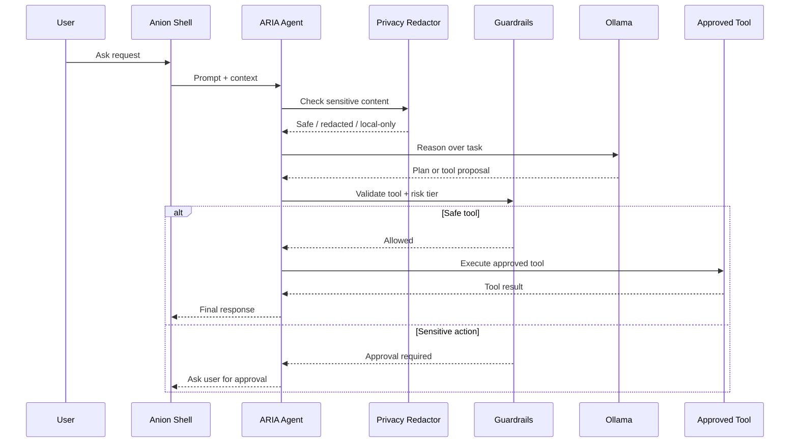

Read more: [`docs/ARIA_AGENT.md`](docs/ARIA_AGENT.md)

---

## 🧠 Context + Memory Flow

Anion is context-aware because it listens to real Linux workflow signals.

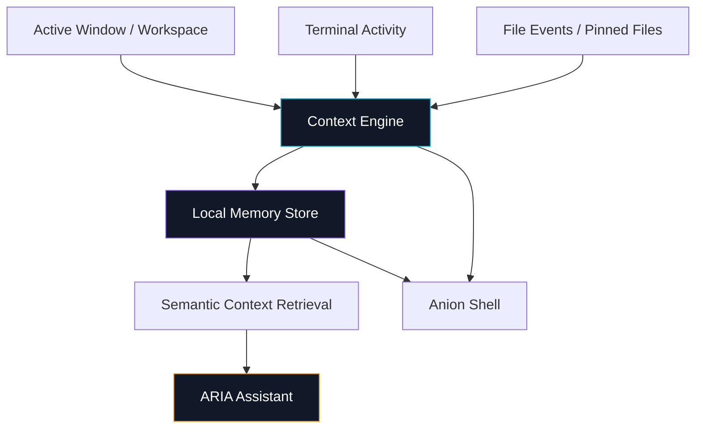

Read more: [`docs/CONTEXT_AND_MEMORY.md`](docs/CONTEXT_AND_MEMORY.md)

---

## 🖥️ Terminal Intelligence Flow

Anion’s terminal layer is designed for developer workflows: history, recovery, and risk previews.

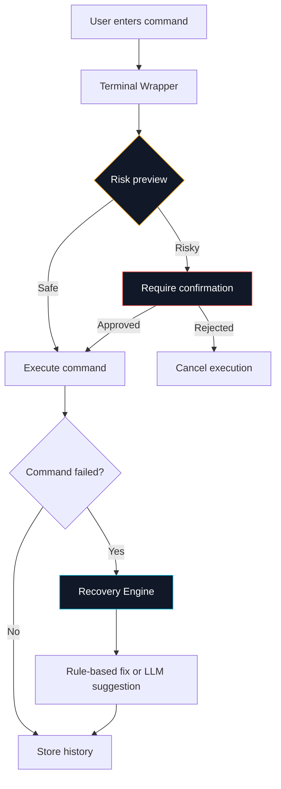

Read more: [`docs/TERMINAL_INTELLIGENCE.md`](docs/TERMINAL_INTELLIGENCE.md)

---

## 🔄 Cross-Device Sync Flow

Anion supports local-network context handoff between Linux machines.

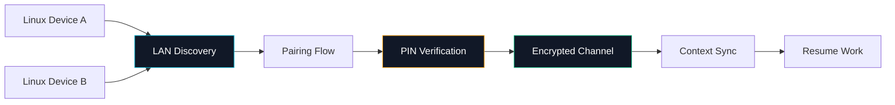

Read more: [`docs/CROSS_DEVICE_SYNC.md`](docs/CROSS_DEVICE_SYNC.md)

---

## ✨ Key Features

<table>
<tr>
<td width="50%" valign="top">

### 🤖 ARIA Assistant

A bounded agentic assistant with tool schemas, risk tiers, privacy checks, and approval-required actions.

**Highlights**

* ReAct-style reasoning loop
* Tool allowlist
* Risk-tier validation
* Pinned file context
* Local model support

</td>
<td width="50%" valign="top">

### 🖥️ Terminal Intelligence

A safer terminal workflow with persistent history, deterministic risk preview, and common-error recovery.

**Highlights**

* Command history
* `ModuleNotFoundError` style recovery
* Destructive-command preview
* Beginner / power mode behavior
* Local model integration

</td>
</tr>
<tr>
<td width="50%" valign="top">

### 🧠 Context + Memory

A local context layer that collects workflow signals and makes them useful to ARIA.

**Highlights**

* Active workspace awareness
* Pinned file context
* Local memory storage
* Semantic retrieval path
* Real-time UI state

</td>
<td width="50%" valign="top">

### 🔐 Privacy + Guardrails

Anion is designed around local-first execution and explicit control over sensitive actions.

**Highlights**

* Ollama-ready local inference
* Local HTTP/SSE bridge
* Guardrailed tools
* Approval prompts
* No unrestricted shell execution

</td>
</tr>
<tr>
<td width="50%" valign="top">

### 🔄 Cross-Device Sync

A private-beta sync flow for continuing context across Linux machines.

**Highlights**

* LAN discovery
* Pairing flow
* Encrypted channel
* Resume context
* Conflict handling path

</td>
<td width="50%" valign="top">

### 🧬 Live Desktop Shell

Electron/React shell that visualizes Anion state through a real-time backend stream.

**Highlights**

* ARIA dashboard
* Live neural brain visual
* Backend health state
* System status cards
* Passive UI / active backend split

</td>
</tr>
</table>

---

## 🖥️ Interface Gallery

<table>
<tr>
<td width="50%" valign="top">
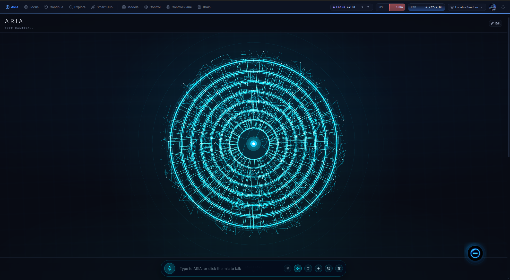
<br />
<strong>ARIA Assistant</strong>
<br />
Bounded agentic assistant for local Linux workflows.
</td>
<td width="50%" valign="top">
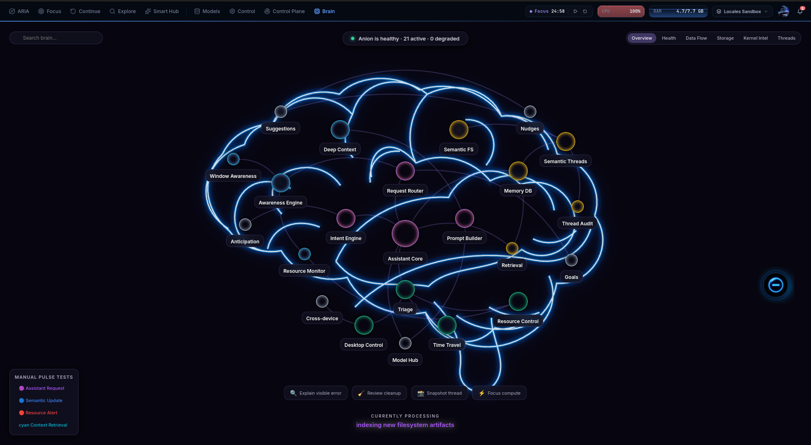
<br />
<strong>Live System Brain</strong>
<br />
Visual runtime layer for context, memory, and local AI state.
</td>
</tr>
<tr>
<td width="50%" valign="top">
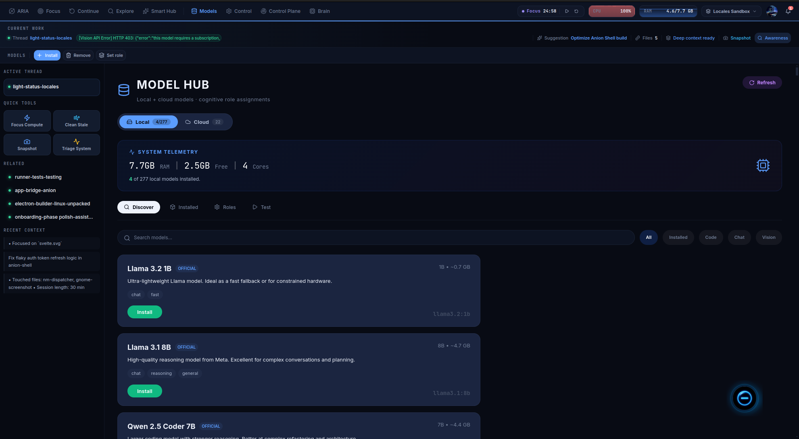
<br />
<strong>Model Hub</strong>
<br />
Local model management and Ollama-ready workflows.
</td>
<td width="50%" valign="top">
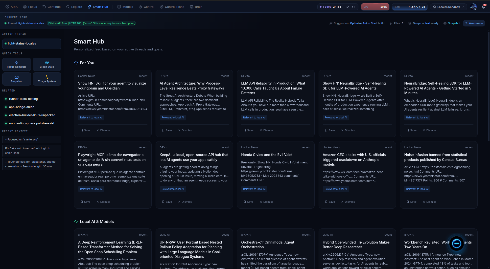
<br />
<strong>Smart Hub</strong>
<br />
Workflow intelligence, suggestions, and system-level assistance.
</td>
</tr>
<tr>
<td width="50%" valign="top">
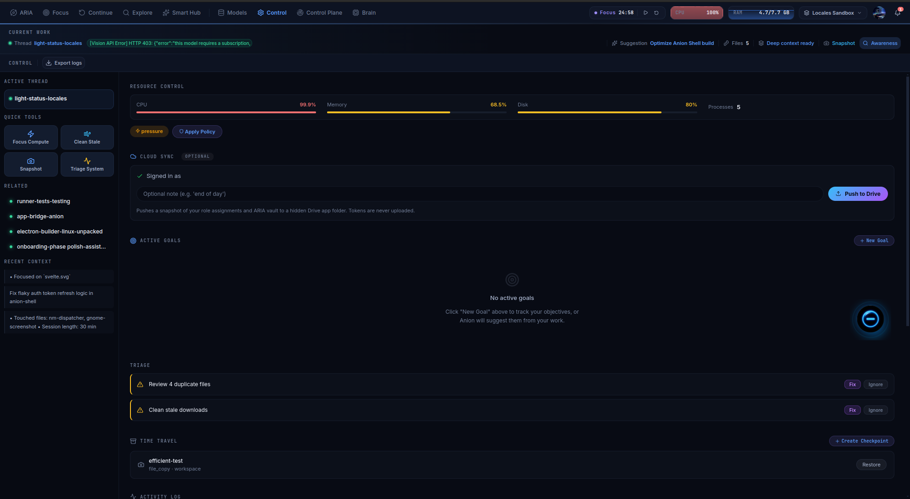
<br />
<strong>Control View</strong>
<br />
System controls, diagnostics, and runtime visibility.
</td>
<td width="50%" valign="top">
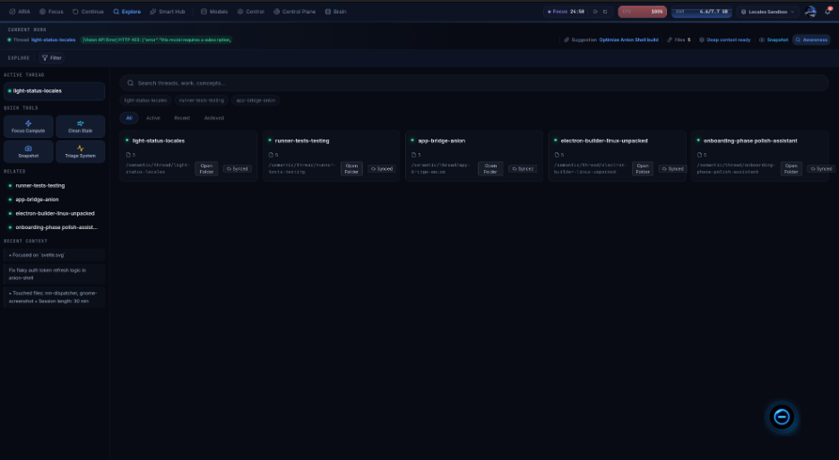
<br />
<strong>Explore</strong>
<br />
Context exploration across workspace, memory, and local activity.
</td>
</tr>
</table>

### 🧑‍💻 Terminal Screenshots

<table>
<tr>
<td width="50%" valign="top">
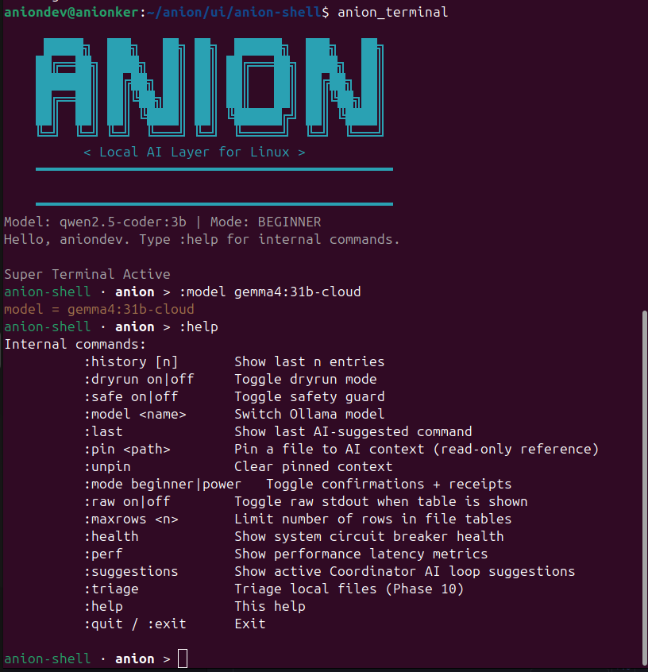
<br />
<strong>Terminal Screenshot 1</strong>
</td>
<td width="50%" valign="top">
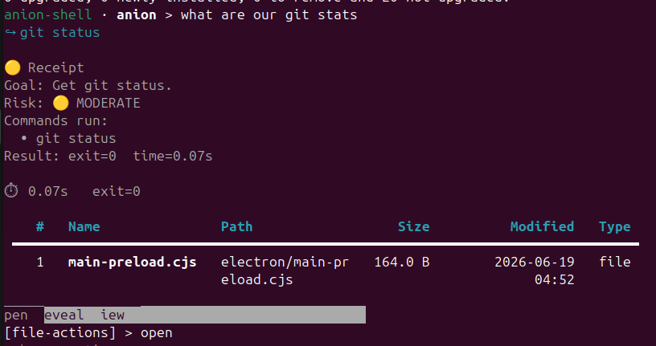
<br />
<strong>Terminal Screenshot 2</strong>
</td>
</tr>
<tr>
<td width="50%" valign="top">
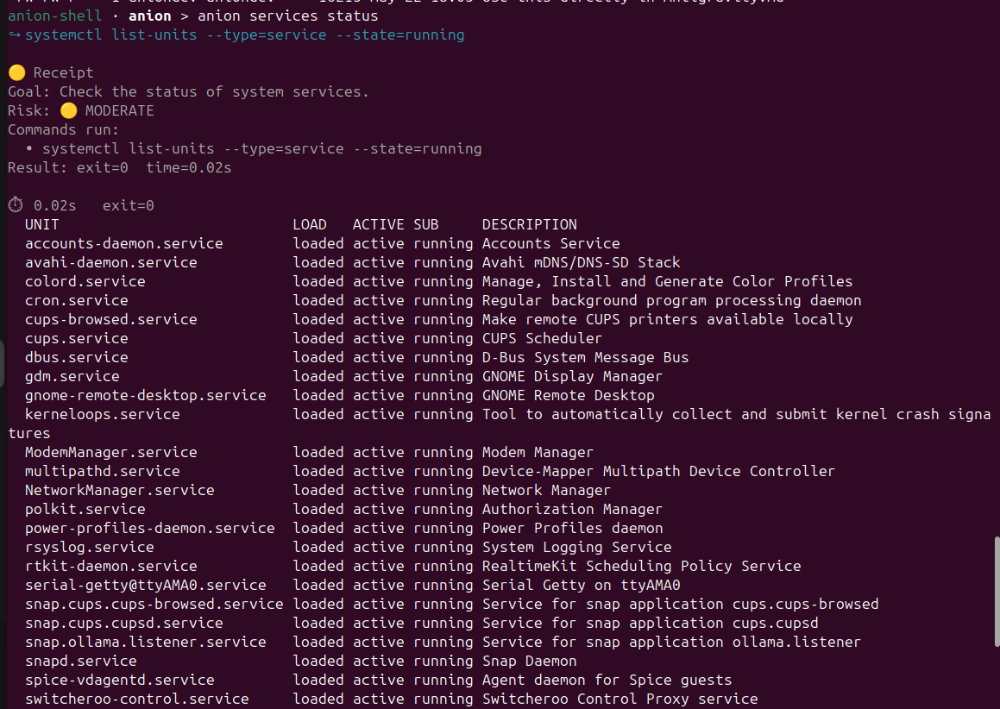
<br />
<strong>Terminal Screenshot 3</strong>
</td>
<td width="50%" valign="top">
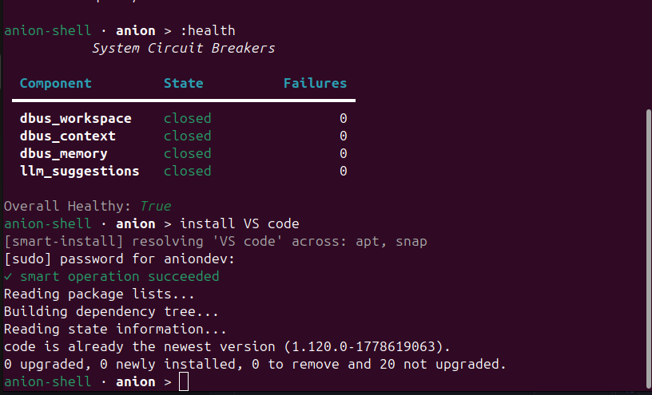
<br />
<strong>Terminal Screenshot 4</strong>
</td>
</tr>
<tr>
<td width="50%" valign="top">
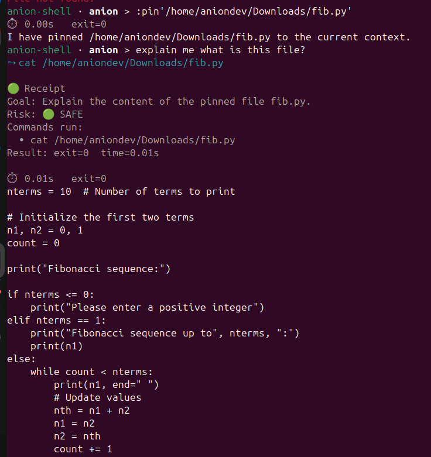
<br />
<strong>Terminal Screenshot 5</strong>
</td>
<td width="50%" valign="top">
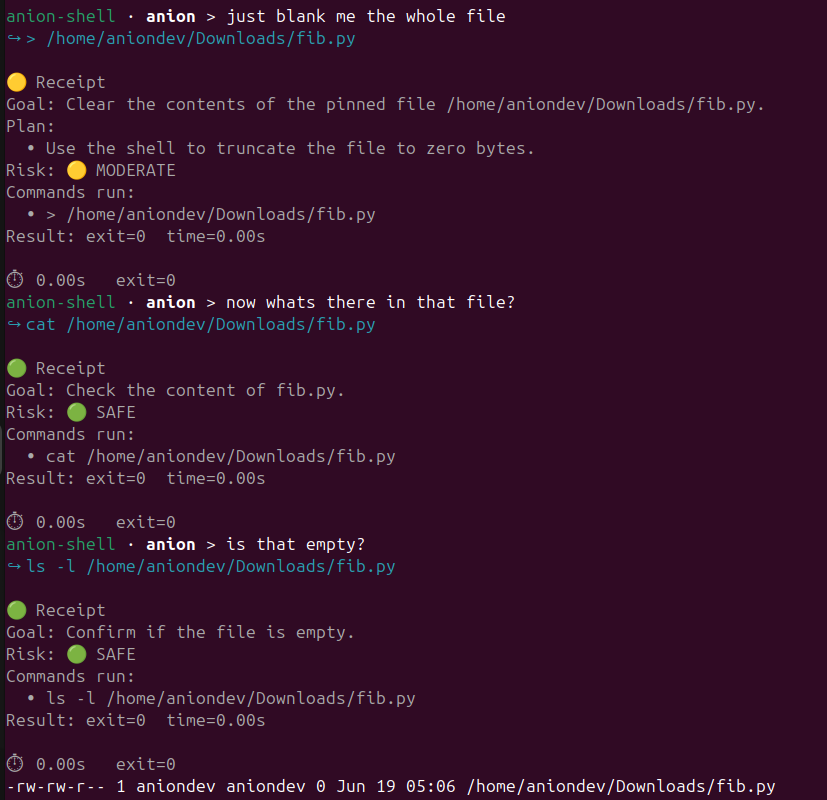
<br />
<strong>Terminal Screenshot 6</strong>
</td>
</tr>
</table>

---

## 🛠️ Tech Stack

| Layer               | Technology                                       |
| ------------------- | ------------------------------------------------ |
| Backend             | Python 3.11+, local daemons, SQLite/WAL          |
| Frontend            | Electron, React, Vite, Three.js                  |
| AI Runtime          | Ollama local models                              |
| Agent Layer         | ARIA, bounded ReAct loop, tool allowlists        |
| Desktop Integration | systemd, FUSE, X11, Sway, i3                     |
| Terminal            | command wrapper, history, recovery, risk preview |
| Sync                | LAN discovery, pairing, encrypted channel        |
| Testing             | pytest, e2e, chaos, soak, gate tests             |
| Security Review     | Bandit, pip-audit, DAST, secret scanning         |
| Packaging           | AppImage / `.deb` Linux packaging                |

---

## 🧪 Testing Pipeline

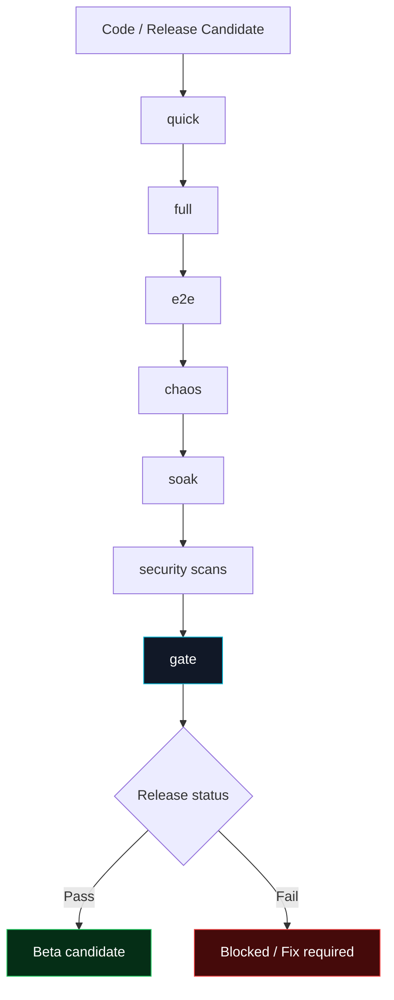

### Test scopes

| Scope   | Purpose                          |
| ------- | -------------------------------- |
| `quick` | Fast smoke checks                |
| `full`  | Main regression suite            |
| `e2e`   | End-to-end workflow validation   |
| `chaos` | Degraded-state and fault testing |
| `soak`  | Long-running stability checks    |
| `gate`  | Release-readiness validation     |

### Security review snapshot

| Area                 | Public status                                         |
| -------------------- | ----------------------------------------------------- |
| Secret scanning      | No public secrets included in this documentation repo |
| DAST                 | Included in release validation notes                  |
| Bandit               | Findings tracked during hardening                     |
| pip-audit            | Dependency findings tracked during hardening          |
| Packaging validation | In progress for beta distribution                     |

Read more: [`docs/TESTING_AND_QA.md`](docs/TESTING_AND_QA.md)

---

## 🔐 Privacy Boundary

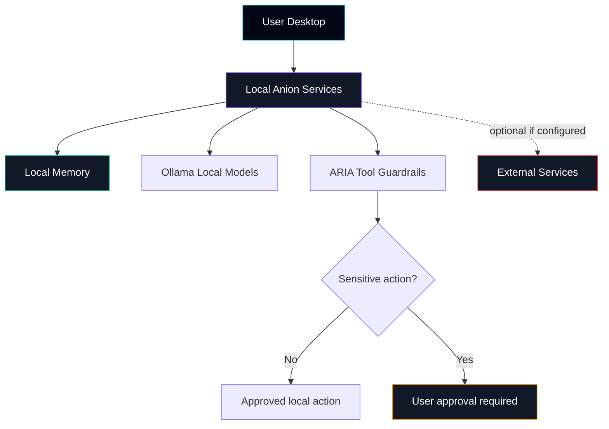

Anion is designed to keep workflows local by default. External services, if supported in a beta build, should be explicitly configured and documented.

Read more: [`PRIVACY.md`](PRIVACY.md)

---

## 🧩 Why This Was Technically Interesting

| Challenge             | What made it hard                                                    |
| --------------------- | -------------------------------------------------------------------- |
| Linux desktop context | Needed real OS signals through systemd, FUSE, X11, Sway, and i3      |
| Agentic safety        | ARIA had to act through bounded tools, risk tiers, and approvals     |
| Real-time state       | UI needed live backend state without becoming the source of truth    |
| Terminal recovery     | Needed deterministic safety checks plus useful recovery suggestions  |
| Local memory          | Needed useful context without making cloud AI the default dependency |
| Cross-device sync     | Needed pairing, encrypted state handoff, and conflict handling       |
| Release validation    | Needed quick, full, e2e, chaos, soak, security, and gate checks      |

---

## 📋 Product Status

<div align="center">

```text
┌─────────────────────────────────────────────────────────────┐
│          Anion v0.1.0 — Release Candidate / Beta             │
├─────────────────────────────────────────────────────────────┤
│  ✅ Feature-complete for current Linux-only scope             │
│  🔄 Dependency CVE remediation                               │
│  🔄 Subprocess security audit                                │
│  🔄 Packaging validation                                     │
│  🔄 Public documentation cleanup                             │
│                                                             │
│  ⚠️  Beta software — intended for Linux power users           │
└─────────────────────────────────────────────────────────────┘
```

</div>

---

## 🔒 Why the Source Is Private

The Anion source code is private during beta because the project includes security-sensitive local automation logic, Linux desktop integration code, packaging scripts, and hardening work that should be resolved before broader exposure.

| Reason             | Detail                                                                                          |
| ------------------ | ----------------------------------------------------------------------------------------------- |
| Security hardening | Known dependency and subprocess findings are tracked before public code release                 |
| Beta stability     | The product is feature-complete for scope but still undergoing packaging and release validation |
| User safety        | Local automation and desktop integration require careful review before open distribution        |
| Licensing          | Source availability will be revisited after security cleanup and licensing decisions            |

> Source availability will be revisited after security cleanup, packaging validation, and licensing decisions are complete.

---

## 📚 Documentation

<table>
<tr>
<td width="50%" valign="top">

### Architecture + Design

* [Architecture](docs/ARCHITECTURE.md)
* [System Design](docs/SYSTEM_DESIGN.md)
* [Product Decisions](docs/PRODUCT_DECISIONS.md)
* [Feature Breakdown](docs/FEATURE_BREAKDOWN.md)

### Core Systems

* [ARIA Agent](docs/ARIA_AGENT.md)
* [Terminal Intelligence](docs/TERMINAL_INTELLIGENCE.md)
* [Context and Memory](docs/CONTEXT_AND_MEMORY.md)
* [Cross-Device Sync](docs/CROSS_DEVICE_SYNC.md)

</td>
<td width="50%" valign="top">

### Operations + Quality

* [Testing and QA](docs/TESTING_AND_QA.md)
* [Release Notes](docs/RELEASE_NOTES.md)
* [Roadmap](docs/ROADMAP.md)
* [Changelog](CHANGELOG.md)

### User Docs

* [Install Linux](docs/INSTALL_LINUX.md)
* [User Manual](docs/USER_MANUAL.md)
* [FAQ](docs/FAQ.md)
* [Privacy](PRIVACY.md)
* [Terms](TERMS.md)
* [Security](SECURITY.md)

</td>
</tr>
</table>

---

## 🚀 Early Beta

<div align="center">

### Anion is currently in private beta.

Early beta is intended for Linux users, developers, terminal-heavy users, local AI users, and people comfortable testing release-candidate software.

<br />

<a href="https://forms.gle/vLVCvox5mjny3VQSA">
  <strong>Request Beta Access →</strong>
</a>

<br />
<br />

Selected testers will receive installation instructions and beta access details by email.

</div>

---

## 👤 My Role

I designed and built Anion end-to-end.

<table>
<tr>
<td width="35%"><strong>Backend architecture</strong></td>
<td>Python services, daemon orchestration, local HTTP/SSE bridge, memory and context systems</td>
</tr>
<tr>
<td><strong>ARIA assistant</strong></td>
<td>Agent loop, tool schemas, guardrails, privacy redaction, risk tiers, approval flows</td>
</tr>
<tr>
<td><strong>Desktop shell</strong></td>
<td>Electron/React interface, live dashboard, neural brain visualization, backend state integration</td>
</tr>
<tr>
<td><strong>Terminal intelligence</strong></td>
<td>Persistent history, recovery engine, destructive-command risk preview</td>
</tr>
<tr>
<td><strong>Sync system</strong></td>
<td>Pairing flow, encrypted context handoff, conflict handling path</td>
</tr>
<tr>
<td><strong>Testing and release</strong></td>
<td>Test harness, security scans, soak tests, gate checks, release documentation</td>
</tr>
</table>

---

## 🧭 Repository Purpose

This repo is for:

* public architecture documentation,
* product and feature explanation,
* recruiter/reviewer visibility,
* beta access information,
* diagrams and release notes,
* public issue/feedback collection.

This repo is not:

* the production source repository,
* an open-source codebase,
* a package registry,
* a public installer mirror.

---

<div align="center">

<br />

## Anion

**A local AI operating layer for the Linux desktop.**

<br />

[GitHub](https://github.com/GopalSinghRajput)
·
[Architecture Docs](docs/ARCHITECTURE.md)
·
[Roadmap](docs/ROADMAP.md)
·
[Beta Access](YOUR_REAL_BETA_FORM_LINK)

<br />
<br />

<sub>Built by <a href="https://github.com/GopalSinghRajput">Gopal Singh Rajput</a></sub>

<br />

</div>