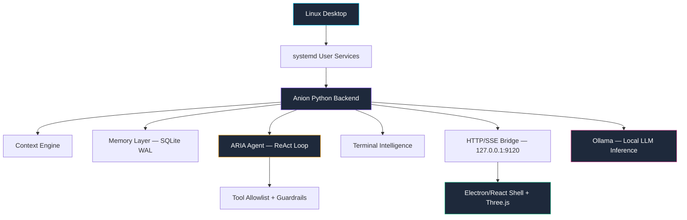

<div align="center">


<br />

# 🧠 Anion

**A local AI operating layer for the Linux desktop.**

<br />

[](docs/INSTALL_LINUX.md)
[](#-early-beta)
[](PRIVACY.md)
[](docs/TESTING_AND_QA.md)

<br />

<em>Privacy-first · On-device AI · Agentic assistant · E2E encrypted sync</em>

<br />

[Architecture](docs/ARCHITECTURE.md) · [Features](docs/FEATURE_BREAKDOWN.md) · [Roadmap](docs/ROADMAP.md) · [Install](docs/INSTALL_LINUX.md) · [FAQ](docs/FAQ.md)

<br />

---

> ⚠️ This is a **public documentation repository**. Source code is private during beta & security hardening.

---

</div>

<br />

## 💡 What is Anion?

Anion is a privacy-first AI assistant layer that lives **on your Linux desktop** — not in the cloud. It bridges your terminal, filesystem, window manager, and local LLMs into a single context-aware system that understands what you're doing and helps you do it better.

<table>
<tr>
<td width="50%">

**Unlike cloud AI wrappers, Anion:**
- Runs 100% on your machine via [Ollama](https://ollama.ai)
- Never phones home or collects telemetry
- Manages services through systemd
- Streams real-time state to a desktop shell
- Encrypts cross-device sync end-to-end

</td>
<td width="50%">

**Built as a complete system:**
- Python backend daemon architecture
- Electron/React desktop shell
- 22-tool agentic assistant (ARIA)
- Terminal intelligence with risk preview
- 742+ tests including chaos & 24hr soak

</td>
</tr>
</table>

<br />

## 🏗️ Architecture



<details>
<summary><strong>📐 Architecture at a glance</strong></summary>

<br />

| Layer | Technology | Role |
|:---:|:---|:---|
| 🔧 | systemd user targets | Daemon orchestration & lifecycle |
| 🐍 | Python 3.11+ | Core backend: context, memory, ARIA |
| 📡 | HTTP REST + SSE | Real-time state streaming to UI |
| 🖥️ | Electron + React + Vite | Desktop shell (pure display layer) |
| 🤖 | Ollama (local) | Privacy-preserving LLM inference |
| 💾 | SQLite (WAL mode) | Persistent memory & semantic search |
| 🔐 | NaCl / Curve25519 | Cross-device E2E encryption |

The frontend is intentionally "dumb" — it contains zero business logic. All state flows from the Python backend via SSE. If the UI crashes, no data is lost.

</details>

<br />

## ✨ Key Features

<table>
<tr>
<td width="50%" valign="top">

### 🤖 ARIA — Agentic Assistant
ReAct-based agent with **22 strictly defined tools**, privacy redaction, risk tiers, and hard budget limits. Cannot run arbitrary commands — halts for approval on sensitive actions.

### 🖥️ Terminal Intelligence
SQLite-backed persistent history, deterministic risk previews (catches `rm -rf` before execution), and hybrid rule-based/LLM recovery for errors like `ModuleNotFoundError`.

### 🧠 Context & Memory
Continuously indexes active windows, terminal ops, and file events into local SQLite with FTS5. Powers queries like *"what was I working on?"*

</td>
<td width="50%" valign="top">

### 🔄 Cross-Device Sync
UDP LAN discovery → 6-digit PIN pairing → NaCl Curve25519 E2E encrypted channels. Zero cloud dependency for sync.

### 🧬 Live Neural Brain
Three.js holographic visualization that pulses with real-time system load and backend health metrics.

### 🔒 Privacy & Guardrails
`PrivacyRedactor` screens prompts before cloud routing. `TOOL_ALLOWLIST` + `RISK_TIERS` gate every action. RLIMIT sandbox for plugins.

</td>
</tr>
</table>

<details>
<summary><strong>🎯 More features...</strong></summary>

<br />

- **Feature Activation Engine** — Context-aware UI nudges with dynamic policy refinement
- **FUSE Semantic Filesystem** — Virtual `~/semantic/` directory with AI-categorized views
- **Ambient Presence Bar** — Lightweight top-bar showing live system state
- **Dynamic Continuity Context** — Unfinished work tracking and triage suggestions
- **Conflict Resolution Modal** — 3-way merge UI for cross-device state collisions
- **Pinned Files Context** — Attach local files to LLM context for targeted queries
- **Unified Semantic Ranking** — 7-factor scoring engine for search relevance

See the full [Feature Breakdown →](docs/FEATURE_BREAKDOWN.md)

</details>

<br />

## 🛠️ Tech Stack

<div align="center">

| | Component | Technology |
|:---:|:---|:---|
| 🐍 | **Backend** | Python 3.11+, SQLite (WAL), FUSE |
| ⚛️ | **Frontend** | Electron 33, React 19, Vite 8, Three.js, Framer Motion |
| 🤖 | **AI** | Ollama (local inference) |
| ⚙️ | **Services** | systemd user targets and services |
| 🖥️ | **Desktop** | wmctrl, xdotool, swaymsg, i3-msg |
| 🔐 | **Crypto** | NaCl / Curve25519 (PyNaCl) |
| 🧪 | **Testing** | pytest (742+), Bandit, pip-audit, custom DAST |
| 📦 | **Packaging** | Electron-Builder (AppImage + .deb) |

</div>

<br />

## 🧪 Testing & Security

<table>
<tr>
<td width="55%" valign="top">

**Test harness scopes:**

| Scope | Purpose |
|:---|:---|
| `quick` | Smoke checks (< 2 min) |
| `full` | Full regression suite |
| `e2e` | End-to-end validation |
| `chaos` | Failure-state testing |
| `soak` | 24-hour stability |
| `gate` | Release readiness |

</td>
<td width="45%" valign="top">

**Security scanning:**

| Tool | Result |
|:---|:---|
| Secret scan | ✅ **0 findings** / 24,700 files |
| DAST | ✅ **Clean** (15 probes) |
| SAST (Bandit) | ⚠️ 9 HIGH (under audit) |
| SCA (pip-audit) | ⚠️ 65 CVEs (dev-only) |

</td>
</tr>
</table>

<br />

## 🧩 Why This Was Technically Interesting

<table>
<tr>
<td>🔩</td>
<td><strong>Deep OS integration</strong> — Hooks into systemd, FUSE, Sway/i3 IPC, X11 for genuine desktop awareness</td>
</tr>
<tr>
<td>🎯</td>
<td><strong>Bounded agentic AI</strong> — Real ReAct agent with strict guardrails: allowlists, risk tiers, budget limits, approval gates</td>
</tr>
<tr>
<td>📡</td>
<td><strong>Real-time architecture</strong> — Backend pushes all state via SSE; UI is a pure renderer with zero business logic</td>
</tr>
<tr>
<td>🔐</td>
<td><strong>Custom crypto protocol</strong> — Raw UDP discovery + NaCl encryption for cloud-free cross-device sync</td>
</tr>
<tr>
<td>🧪</td>
<td><strong>Production testing</strong> — 742+ tests, chaos testing, 24hr soak, SAST/SCA/DAST integrated into release gate</td>
</tr>
</table>

<br />

## 📋 Product Status

<div align="center">

```
┌─────────────────────────────────────────────────────┐
│   Anion v0.1.0 — Release Candidate (Private Beta)   │
│                                                     │
│   ✅ Feature-complete for intended scope             │
│   🔄 Dependency CVE remediation                     │
│   🔄 Subprocess security audit                      │
│   🔄 Packaging validation                           │
│   🔄 Public documentation finalization              │
│                                                     │
│   ⚠️  Beta software — expect rough edges             │
└─────────────────────────────────────────────────────┘
```

</div>

<br />

## 🔐 Why the Source Is Private

| Reason | Detail |
|:---|:---|
| Security hardening | Known subprocess findings and dependency CVEs need resolution before public exposure |
| Beta stability | Feature-complete but not consumer-ready |
| Responsible disclosure | Opening source prematurely could expose attack surface before mitigations |

**The plan:** Open-source Anion after security cleanup is complete.

<br />

## 📚 Documentation

<table>
<tr>
<td valign="top" width="50%">

**Architecture & Design**
- [Architecture](docs/ARCHITECTURE.md) — System topology & services
- [System Design](docs/SYSTEM_DESIGN.md) — Decisions & tradeoffs
- [Product Decisions](docs/PRODUCT_DECISIONS.md) — Why Linux-only, why local-first

**Features**
- [Feature Breakdown](docs/FEATURE_BREAKDOWN.md) — Complete inventory
- [ARIA Agent](docs/ARIA_AGENT.md) — Agentic assistant deep dive
- [Terminal Intelligence](docs/TERMINAL_INTELLIGENCE.md) — CLI safety & recovery
- [Context & Memory](docs/CONTEXT_AND_MEMORY.md) — Memory engine
- [Cross-Device Sync](docs/CROSS_DEVICE_SYNC.md) — E2E encrypted sync

</td>
<td valign="top" width="50%">

**Operations & Quality**
- [Testing & QA](docs/TESTING_AND_QA.md) — Test philosophy & scanning
- [Release Notes](docs/RELEASE_NOTES.md) — v1 RC summary
- [Roadmap](docs/ROADMAP.md) — Future priorities

**User Guides**
- [Install Guide](docs/INSTALL_LINUX.md) — Linux installation
- [User Manual](docs/USER_MANUAL.md) — End-user guide
- [FAQ](docs/FAQ.md) — Common questions

</td>
</tr>
</table>

<br />

## 🚀 Early Beta

<div align="center">

**Anion is in private beta.**

[Request Beta Access](https://forms.gle/PLACEHOLDER) <!-- TODO: Replace with actual form link -->

Beta access can be revoked at any time. Report issues via [GitHub issue templates](.github/ISSUE_TEMPLATE/).

</div>

<br />

## 👤 My Role

I am the **sole developer and architect** of Anion. Designed and implemented from scratch:

<table>
<tr>
<td>🐍 Full Python backend</td>
<td>Daemon services, HTTP bridge, memory engine, context system</td>
</tr>
<tr>
<td>🤖 ARIA agent</td>
<td>ReAct loop, tool schemas, guardrails, privacy redaction</td>
</tr>
<tr>
<td>⚛️ Desktop shell</td>
<td>Electron/React UI, Three.js Brain, SSE integration</td>
</tr>
<tr>
<td>🖥️ Terminal intelligence</td>
<td>History, recovery engine, risk preview</td>
</tr>
<tr>
<td>🔐 Sync protocol</td>
<td>UDP discovery, NaCl Curve25519 E2E encryption</td>
</tr>
<tr>
<td>🧪 Test harness</td>
<td>742+ tests, chaos, soak, SAST/SCA/DAST</td>
</tr>
<tr>
<td>⚙️ Infrastructure</td>
<td>systemd services, packaging pipeline</td>
</tr>
</table>

<br />

---

<div align="center">

<br />

**[GitHub](https://github.com/GopalSinghRajput)** · **[Architecture Docs](docs/ARCHITECTURE.md)** · **[Roadmap](docs/ROADMAP.md)**

<br />

<sub>Built with care by <a href="https://github.com/GopalSinghRajput">Gopal Singh Rajput</a> 🇮🇳</sub>

<br />

</div>
