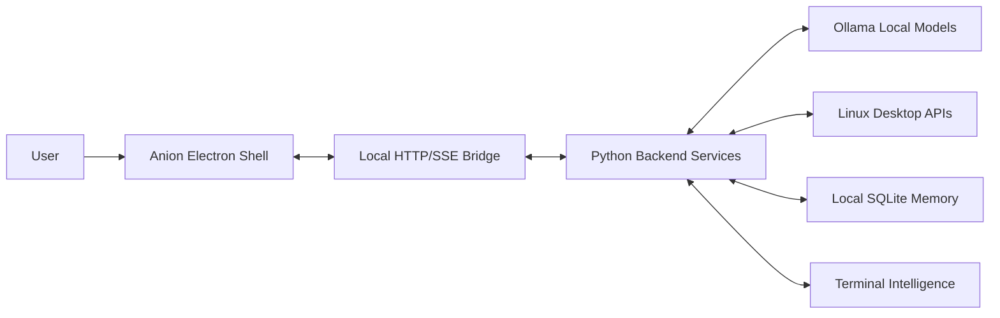
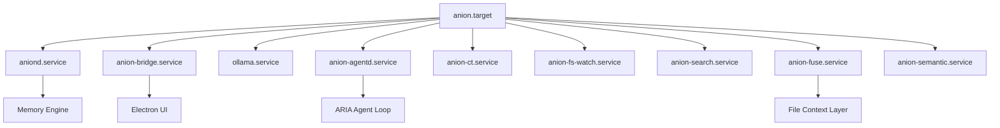
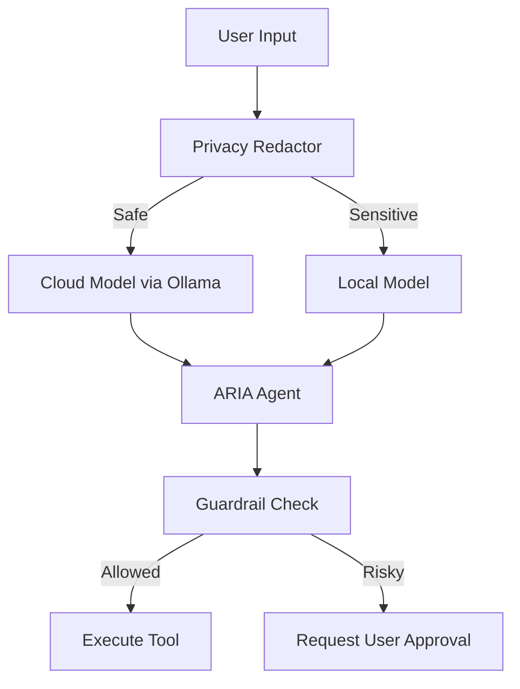

# Architecture

## Overview

Anion operates on a client-server architecture running entirely on `localhost`. The Python backend is the "brain" — it owns all state, intelligence, and system integration. The Electron/React frontend is a pure display layer that renders whatever the backend pushes via Server-Sent Events (SSE).

This separation is intentional: it keeps the system debuggable, testable, and resilient. If the UI crashes, no data is lost. If the UI is closed, the backend continues observing context and accumulating memory.

---

## System Context Diagram

---

## Runtime Services Diagram

---

## Layer Breakdown

### 1. Linux Desktop Layer

Anion is built for Linux and leverages OS-specific capabilities:

- **systemd user services** for daemon lifecycle management
- **Window manager IPC** via `swaymsg` (Sway), `i3-msg` (i3), `wmctrl`/`xdotool` (X11)
- **FUSE** for filesystem-level context tracking
- **D-Bus** for desktop search integration

### 2. systemd User Services

All Anion background processes are managed through systemd user targets:

| Service | Purpose |
|:---|:---|
| `anion.target` | Full service orchestration target |
| `anion-ui.target` | Minimal target for UI operation |
| `aniond.service` | Core daemon (context, memory, coordinator) |
| `anion-bridge.service` | HTTP/SSE bridge on `127.0.0.1:9120` |
| `anion-agentd.service` | ARIA agentic assistant daemon |
| `anion-ct.service` | Context tracking service |
| `anion-fs-watch.service` | Filesystem event watcher |
| `anion-search.service` | D-Bus search integration |
| `anion-fuse.service` | FUSE semantic filesystem |
| `anion-semantic.service` | Semantic indexing service |

### 3. Python Backend

The backend is the core of Anion. Key modules:

- **`anion_http_bridge.py`** — Central REST/SSE server. Exposes the unified API on `127.0.0.1:9120` that powers all UI state.
- **`aniond.py`** — Core daemon coordinating context, memory, and system observability.
- **`anion_memory_engine.py`** — SQLite (WAL mode) backed memory store for semantic history and interactions.
- **`anion_semantic.py`** — Semantic indexing and full-text search with FTS5 inverted indexes.
- **`anion_desktop.py`** — Desktop window management abstraction layer (Sway/i3/X11).
- **`anion_guardrail.py`** — Security guardrails for ARIA tool execution.
- **`anion_message_bus.py`** — In-process pub/sub event bus.
- **`anion_recovery.py`** — Crash resilience through periodic state checkpoints.
- **`semantic_ranker.py`** — 7-factor deterministic ranking for search results.

### 4. Local HTTP/SSE Bridge

The bridge on `127.0.0.1:9120` is the only communication channel between backend and frontend:

- **REST endpoints** for queries, actions, and configuration
- **SSE stream** for real-time state pushes (UI snapshot, brain health, suggestions)
- **Strict localhost binding** — never exposed to the network

The UI polls nothing. It subscribes to the SSE stream and renders what it receives.

### 5. Electron/React Shell

The frontend is built with:

- **Electron 33** as the desktop container
- **React 19** with **Vite 8** for fast development
- **Three.js** for the holographic Brain visualization
- **Framer Motion** for UI animations

The shell is intentionally "dumb" — it contains no business logic. All state comes from the backend via `/api/ui/snapshot` and the SSE stream.

### 6. ARIA Agent

ARIA is a bounded agentic assistant using a ReAct loop:

- Powered by Ollama local models
- 22 strictly defined tools with JSON schemas
- `TOOL_ALLOWLIST` with `RISK_TIERS`
- Privacy redaction before any cloud routing
- Hard budgets: max 3 LLM steps, max 6 tool calls, wall-clock timeout
- `LOCAL_LEAN_TOOLS` subset for smaller models

See [ARIA Agent Documentation](ARIA_AGENT.md) for details.

### 7. Context Engine

Captures real-time system state:

- Active window title and workspace (via WM IPC)
- Terminal command history and outputs
- File events and modifications
- System performance (CPU, memory)

### 8. Memory Engine

Backed by SQLite in WAL mode:

- Semantic memory entries
- Interaction history
- FTS5 full-text search indexes
- Continuous background indexing

### 9. Terminal Intelligence

An intelligent CLI wrapper providing:

- Persistent SQLite-backed command history
- Deterministic risk preview for destructive commands
- Hybrid rule-based/LLM recovery suggestions

### 10. FUSE Semantic Filesystem

Projects a virtual directory structure at `~/semantic/` with:

- `~/semantic/search/` — AI-categorized search results
- `~/semantic/thread/` — Semantic conversation threads
- `~/semantic/time/` — Time-based views

### 11. Cross-Device Sync

Custom peer-to-peer sync protocol:

- UDP broadcast discovery on port 5354
- 6-digit PIN pairing
- NaCl Curve25519 E2E encrypted data channel
- Timeline events and state diffs

### 12. Local Ollama Model Integration

Anion uses Ollama for all AI inference:

- Local models for privacy-sensitive operations
- Cloud model fallback (optional, routed through local Ollama daemon)
- `LOCAL_LEAN_TOOLS` optimization for smaller models (e.g., Llama 3.2 3B)

### 13. Privacy Boundaries

- **PrivacyRedactor** screens all prompts before cloud routing
- **Guardrails** validate every tool call against `TOOL_ALLOWLIST`
- **Risk tiers** classify tool sensitivity
- **Approval gates** halt execution for sensitive operations
- **RLIMIT sandbox** constrains plugin resource usage

### 14. Why Backend-Active, Frontend-Passive

| Concern | Backend | Frontend |
|:---|:---|:---|
| State management | ✅ Owns all state | ❌ Receives via SSE |
| Business logic | ✅ All reasoning here | ❌ Pure renderer |
| AI inference | ✅ Runs Ollama calls | ❌ Displays results |
| Crash resilience | ✅ Survives UI crash | ❌ Reconnects on restart |
| Testability | ✅ Fully unit testable | ❌ Integration tests only |

This architecture ensures the system remains functional and data-safe even if the UI is closed, crashed, or being rebuilt.
