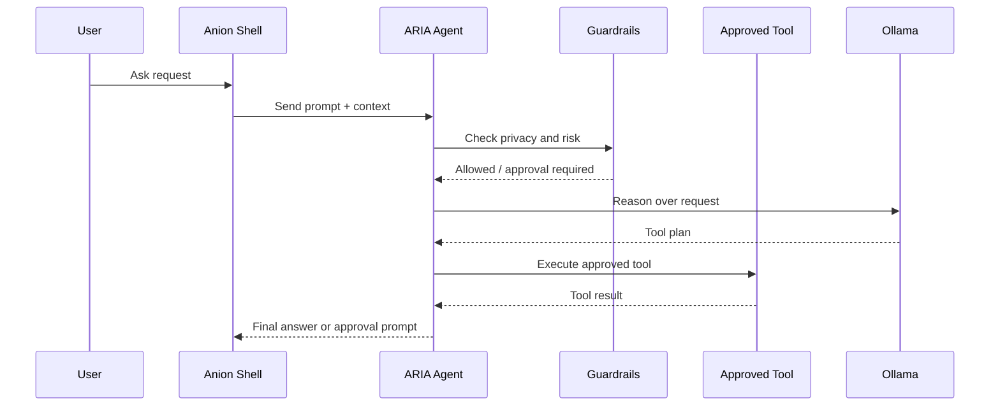

# ARIA Agent

ARIA is Anion's built-in agentic assistant — a voice and text AI that can reason, plan, and take bounded actions on your Linux desktop.

---

## What is ARIA?

ARIA (Anion Runtime Intelligence Agent) is an agentic system capable of modifying the local environment, scheduling events, and reasoning over files. It operates through a ReAct (Reason + Act) loop powered by local Ollama models.

## How ARIA Differs from a Normal Chatbot

| Aspect | Normal Chatbot | ARIA |
|:---|:---|:---|
| Actions | Text responses only | Can execute 22 real tools |
| Context | Conversation history only | Desktop state, files, terminal, memory |
| Safety | No constraints needed | Tool allowlist, risk tiers, approval gates |
| Autonomy | None | Chains multiple reasoning + action steps |
| Privacy | Cloud-dependent | Local-first with privacy redaction |

---

## Bounded Agentic Design

ARIA is agentic but constrained:

- **Max 3 LLM reasoning steps** per request
- **Max 6 tool calls** per request
- **Wall-clock timeout** prevents runaway loops
- **Every tool must be in the `TOOL_ALLOWLIST`**
- **High-risk actions halt for user approval**

This design gives ARIA real capability while preventing hallucination-driven damage.

## ReAct Loop



ARIA follows Thought → Action → Observation cycles:
1. **Thought**: Reason about the request and available tools
2. **Action**: Select and call a tool from the allowlist
3. **Observation**: Process the tool result
4. Repeat or return final answer

## Tool Schemas

Each of ARIA's 22 tools is defined with a strict JSON schema:

```json
{
  "name": "set_timer",
  "description": "Set a countdown timer",
  "parameters": {
    "duration_seconds": {"type": "integer", "required": true},
    "label": {"type": "string", "required": false}
  }
}
```

Tools include: `set_timer`, `open_app`, `read_file`, `web_search`, `create_note`, `set_reminder`, and more. Each has explicit parameter types and validation.

## Tool Allowlist

The `TOOL_ALLOWLIST` is a hardcoded list of exactly 22 approved tools. Any tool call not in this list is rejected immediately. Adding new tools requires:

1. Define the JSON schema in `TOOL_SCHEMAS`
2. Add the tool to `TOOL_ALLOWLIST`
3. Specify the risk level in `RISK_TIERS`
4. Implement the logic with strict type validation via `validate_args`

## Risk Tiers

| Tier | Examples | Behavior |
|:---|:---|:---|
| **Low** | `set_timer`, `web_search`, `create_note` | Executed automatically |
| **Medium** | `open_app`, `read_file` | Executed with logging |
| **High** | Actions modifying system state | Halted; `approval_required=true` returned to UI |

## Approval-Required Actions

When ARIA encounters a high-risk action:
1. The ReAct loop halts
2. An `approval_required=true` state is pushed to the UI
3. The user sees a clear description of what ARIA wants to do
4. Only after explicit user approval does execution continue

ARIA cannot run arbitrary bash commands. It cannot delete files. It cannot bypass the approval system.

## Privacy Checks

Before any LLM call:
1. The `PrivacyRedactor` scans the prompt for sensitive content
2. If sensitive content is detected, the request is routed to a local Ollama model instead of cloud
3. File contents, terminal history, and desktop context are screened

## Local vs Cloud Routing

```
User prompt → PrivacyRedactor → Safe? → Cloud model (via Ollama)
                                → Sensitive? → Local model (Ollama)
```

Cloud routing is optional and goes through the user's own Ollama daemon. Anion never handles API keys or cloud credentials directly.

## LOCAL_LEAN_TOOLS

For smaller local models (e.g., Llama 3.2 3B), ARIA uses a reduced `LOCAL_LEAN_TOOLS` subset. This skips heavy tool prefilling to prevent CPU over-exertion on resource-constrained hardware.

## What ARIA Can Do

- Set timers and reminders
- Open known applications (VS Code, browser, terminal)
- Read pinned files and answer questions about them
- Perform web searches
- Keep track of facts, notes, and to-do items
- Provide weather information
- Manage a Pomodoro timer
- Stream responses in real-time

## What ARIA Cannot Do

- Run arbitrary shell commands
- Delete files or modify the filesystem destructively
- Access applications not in its tool set
- Bypass the approval system for high-risk actions
- Execute more than 6 tool calls per request
- Access the internet without going through the web_search tool

## Safe Tool Addition Principles

1. **Define before implement** — Schema must exist before code
2. **Validate all inputs** — Use `validate_args` with strict type checking
3. **Assign risk tier** — Every tool must have an explicit risk classification
4. **Test the tool** — Add to the test suite before merging
5. **Avoid shell access** — Never allow `shell=True` in tool implementations

## User Examples

**"Set a timer for 25 minutes for focused work"**
→ ARIA calls `set_timer(duration_seconds=1500, label="focused work")`

**"What's in my pinned research paper?"**
→ ARIA calls `read_file()` on the pinned file, then summarizes the content

**"Open VS Code"**
→ ARIA calls `open_app(app_name="code")`

**"Search for Python async patterns"**
→ ARIA calls `web_search(query="Python async patterns")`, returns summarized results
