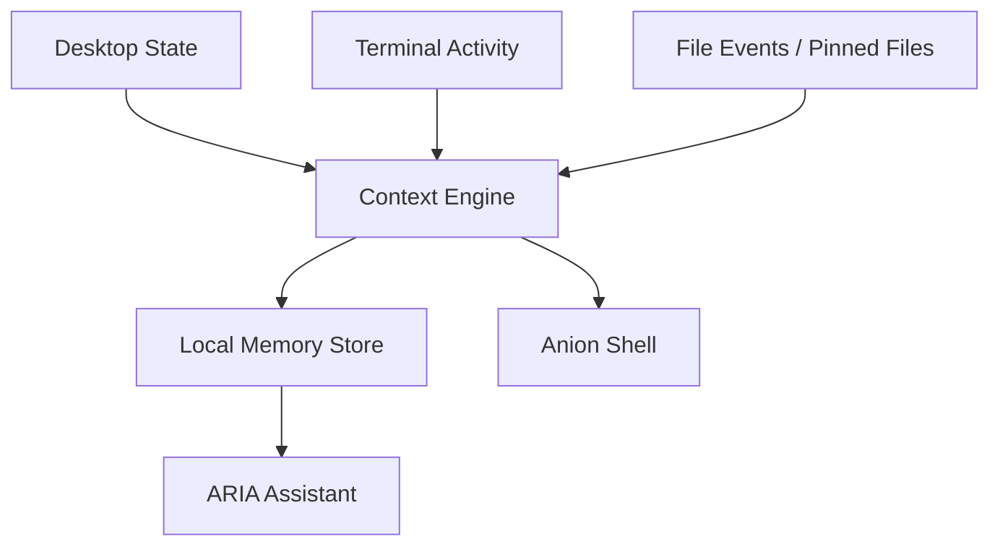

# Context and Memory

How Anion understands your workflow and remembers your history.

---

## What Context Means in Anion

Context is the real-time understanding of what you're doing right now. Anion continuously captures:

- Which application window is in focus
- What workspace you're on
- What commands you've run in the terminal
- What files you've recently modified
- Your system's performance state (CPU, memory)

This context feeds into ARIA's reasoning, allowing it to provide relevant assistance without you needing to explain your situation.

---

## Active Window/Workspace Context

Anion uses Linux window manager APIs to capture desktop state:

| Window Manager | Method |
|:---|:---|
| X11 | `wmctrl`, `xdotool` |
| Sway | `swaymsg` |
| i3 | `i3-msg` |

Captured data includes:
- Active window title
- Window class/application name
- Workspace number
- Window geometry

This allows ARIA to respond to requests like "summarize this window" or "what am I looking at?"

## File Context

Anion tracks file activity through multiple channels:

- **Filesystem watcher** — Monitors file changes in real-time
- **FUSE layer** — Tracks file access through the semantic filesystem
- **Pinned files** — User-selected files injected into LLM context

File metadata (names, paths, modification times) is indexed; file contents are only read when explicitly requested or pinned.

## Terminal Context

The terminal intelligence module captures:

- Command history with timestamps and exit codes
- Error output for recovery suggestions
- Working directory changes
- Session boundaries

## Semantic Memory

Beyond real-time context, Anion maintains persistent semantic memory:

- **Interaction history** — Past ARIA conversations
- **Semantic entries** — Important facts, notes, and observations
- **File index** — Metadata about files in the workspace
- **Timeline events** — Chronological record of significant actions

All stored in a local SQLite database using WAL mode for concurrent access.

## SQLite/WAL Storage

The memory engine uses SQLite with Write-Ahead Logging (WAL):

- **Concurrent reads and writes** — Multiple services can access the database simultaneously
- **Crash resilience** — WAL provides atomic transactions
- **Full-text search** — FTS5 indexes enable fast semantic queries
- **Triggers** — Inverted indexes rebuilt automatically on data changes

## Pinned Files

Users can pin files in the Anion Shell UI to add them to the LLM context:

- Pin any local file (documents, code, notes)
- File content is read and injected into ARIA's prompt
- Ask ARIA questions about the pinned files
- Unpin to remove from context

## Local Storage and Privacy

All context and memory data is stored locally:

- Database location: `~/.anion/`
- No cloud sync by default
- No telemetry or analytics
- User can delete all data by removing `~/.anion/`

## How Context Helps ARIA

| User Request | Context Used |
|:---|:---|
| "Summarize this window" | Active window title + content |
| "What was I working on?" | Terminal history + file events |
| "Remind me what I typed earlier" | Command history |
| "Help me with this error" | Terminal error output |
| "What's in my pinned file?" | Pinned file content |

## User Controls

- **Pin/unpin files** in the UI
- **Clear memory** by removing `~/.anion/`
- **Stop context tracking** by stopping the daemon (`scripts/anion down`)
- **Disable FUSE** by not mounting the semantic filesystem

## Limitations

- Context captures metadata, not full screen content (no screenshots by default)
- Memory grows over time — no automatic pruning in v1
- File content is only indexed when pinned or accessed through FUSE
- Window title accuracy depends on the application and window manager
