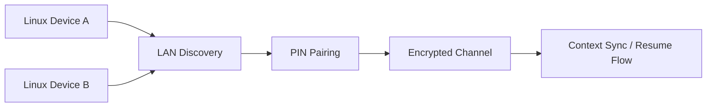

# Cross-Device Sync

Securely sync your Anion context across multiple Linux machines on the same network.

---

## Overview

Anion's cross-device sync enables encrypted state transfer between paired Linux machines. It uses custom UDP discovery, PIN-based pairing, and NaCl Curve25519 end-to-end encryption — no cloud servers required for LAN sync.

---

## What Sync Does

- Transfers timeline events between paired devices
- Syncs state diffs (active work, notes, context)
- Enables "Resume Context" — pick up where you left off on another machine
- Surfaces a conflict resolution modal when states collide

## LAN Discovery

Anion discovers other instances on the local network using UDP broadcasts:

- **Protocol:** UDP on port 5354
- **Discovery packet:** `HELLO` broadcast
- **Scope:** Local network only (not routable beyond LAN)
- **Automatic:** Devices appear in the UI when discovered

### Prerequisites

- Both devices must be on the same local network
- UDP broadcasts must not be blocked (check for "AP Isolation" / "Client Isolation" in router settings)
- The sync directory must be initialized: `mkdir -p ~/.anion/sync`

## Pairing via PIN

Once devices discover each other:

1. Initiate pairing from either device's UI
2. A **6-digit PIN** is displayed on the initiating device
3. Enter the PIN on the receiving device
4. Both devices exchange public keys
5. An encrypted channel is established

Pairing is a one-time process. Once paired, devices reconnect automatically on the same network.

## Encrypted Channel

All sync traffic is encrypted end-to-end:

- **Algorithm:** NaCl / Curve25519
- **Key exchange:** During PIN pairing
- **Encryption:** Box construction (authenticated encryption)
- **No relay servers:** Data flows directly between devices

Even if someone intercepts the network traffic, they cannot read the sync payloads without the encryption keys.

## Conflict Modal

When both devices modify the same state:

1. The sync engine detects a conflict
2. A 3-way merge UI appears in the desktop shell
3. You can choose:
   - Keep local version
   - Keep remote version
   - Merge manually

## Resume Context

When you switch devices:

1. The UI on your new device detects active work from the paired device
2. A "Resume Context" button appears
3. Clicking it loads your previous context (open files, terminal state, notes)

## Cloud Sync Alternative

If LAN sync isn't possible (e.g., different networks, AP isolation), you can use cloud sync:

1. Sign into your Google Account from the User Menu in the app
2. Sync data passes through Firebase infrastructure
3. E2E encryption still applies to payload contents

## Limitations

- **LAN only** — Direct sync requires the same local network
- **Linux to Linux** — No Windows/macOS clients
- **State and metadata** — v1 syncs state diffs, not full file contents
- **AP isolation** — Some routers block UDP broadcasts between clients
- **Conflict resolution** — Complex file-level merges are not yet supported

## Troubleshooting

| Issue | Solution |
|:---|:---|
| Devices not discovering each other | Check for AP isolation in router settings |
| Pairing fails | Ensure both devices have `~/.anion/sync` directory |
| Sync stopped working | Run `scripts/anion restart` on both devices |
| Conflict modal not appearing | Check that the bridge service is running |
